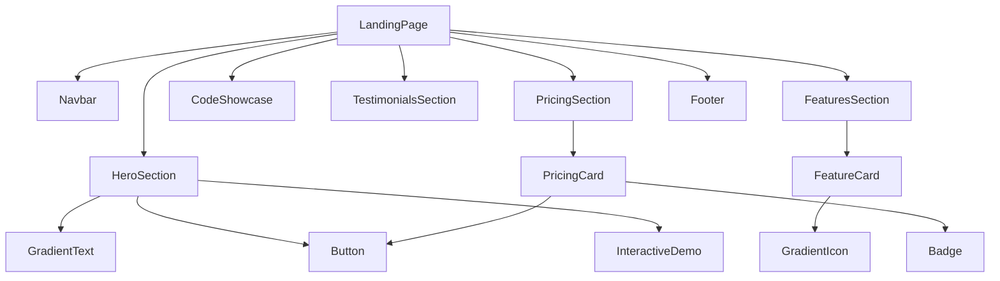

# Design Document: Clerk-Style Redesign

## Overview

This design document outlines the complete UI/UX redesign of Zalt.io's landing page and dashboard to create the most advanced, visually stunning authentication platform landing page of 2026. Inspired by Steve Jobs' legendary product presentations and Clerk.com's modern aesthetic, this redesign combines:

- **Cinematic Hero Animations**: 3D lock transformations, particle systems, and morphing security shields
- **Apple-Level Polish**: Pixel-perfect typography, buttery-smooth 60fps animations, and obsessive attention to detail
- **Interactive Security Theater**: Real-time threat visualization, biometric scan simulations, and encryption visualizations
- **Emotional Storytelling**: Each section tells a story about security, trust, and peace of mind
- **Micro-interactions Everywhere**: Every hover, click, and scroll triggers delightful feedback

The goal is not just to match Clerk, but to surpass it - creating a landing page that makes visitors say "I've never seen anything like this."

## Architecture

### Design System Architecture

```
dashboard/src/
├── styles/
│   └── clerk-theme.ts          # Design tokens and theme configuration
├── components/
│   ├── landing/                 # Landing page components (redesigned)
│   │   ├── Navbar.tsx
│   │   ├── HeroSection.tsx
│   │   ├── FeaturesSection.tsx
│   │   ├── CodeShowcase.tsx
│   │   ├── PricingSection.tsx
│   │   ├── TestimonialsSection.tsx
│   │   ├── Footer.tsx
│   │   └── index.ts
│   ├── ui/                      # Shared UI components
│   │   ├── Button.tsx
│   │   ├── Card.tsx
│   │   ├── Input.tsx
│   │   ├── Badge.tsx
│   │   ├── GradientText.tsx
│   │   └── index.ts
│   └── dashboard/               # Dashboard components (redesigned)
│       ├── Sidebar.tsx
│       ├── Header.tsx
│       └── ...
├── lib/
│   └── motion.ts               # Framer Motion presets
└── app/
    ├── globals.css             # Updated global styles
    └── page.tsx                # Landing page
```

### Component Hierarchy



## Components and Interfaces

### Design Tokens Interface

```typescript
interface ClerkTheme {
  colors: {
    // Primary palette
    primary: {
      50: '#F5F3FF';
      100: '#EDE9FE';
      200: '#DDD6FE';
      300: '#C4B5FD';
      400: '#A78BFA';
      500: '#8B5CF6';
      600: '#7C3AED';
      700: '#6D28D9';
      800: '#5B21B6';
      900: '#4C1D95';
    };
    // Accent (blue)
    accent: {
      400: '#38BDF8';
      500: '#0EA5E9';
      600: '#0284C7';
    };
    // Neutrals
    neutral: {
      50: '#FAFAFA';
      100: '#F4F4F5';
      200: '#E4E4E7';
      300: '#D4D4D8';
      400: '#A1A1AA';
      500: '#71717A';
      600: '#52525B';
      700: '#3F3F46';
      800: '#27272A';
      900: '#18181B';
      950: '#0F0F10';
    };
    // Semantic
    success: '#22C55E';
    warning: '#F59E0B';
    error: '#EF4444';
    info: '#3B82F6';
  };
  
  gradients: {
    primary: 'linear-gradient(135deg, #6C47FF 0%, #00D4FF 100%)';
    primaryHover: 'linear-gradient(135deg, #5B3DE8 0%, #00BFE8 100%)';
    text: 'linear-gradient(90deg, #6C47FF 0%, #00D4FF 100%)';
    card: 'linear-gradient(180deg, rgba(108,71,255,0.05) 0%, rgba(0,212,255,0.05) 100%)';
    border: 'linear-gradient(135deg, #6C47FF 0%, #00D4FF 100%)';
  };
  
  typography: {
    fontFamily: {
      sans: 'Inter, -apple-system, BlinkMacSystemFont, sans-serif';
      mono: 'JetBrains Mono, Menlo, Monaco, monospace';
    };
    fontSize: {
      xs: '0.75rem';    // 12px
      sm: '0.875rem';   // 14px
      base: '1rem';     // 16px
      lg: '1.125rem';   // 18px
      xl: '1.25rem';    // 20px
      '2xl': '1.5rem';  // 24px
      '3xl': '1.875rem';// 30px
      '4xl': '2.25rem'; // 36px
      '5xl': '3rem';    // 48px
      '6xl': '3.75rem'; // 60px
      '7xl': '4.5rem';  // 72px
    };
    fontWeight: {
      normal: 400;
      medium: 500;
      semibold: 600;
      bold: 700;
    };
    lineHeight: {
      tight: 1.1;
      snug: 1.25;
      normal: 1.5;
      relaxed: 1.625;
    };
  };
  
  spacing: {
    0: '0';
    1: '0.25rem';   // 4px
    2: '0.5rem';    // 8px
    3: '0.75rem';   // 12px
    4: '1rem';      // 16px
    5: '1.25rem';   // 20px
    6: '1.5rem';    // 24px
    8: '2rem';      // 32px
    10: '2.5rem';   // 40px
    12: '3rem';     // 48px
    16: '4rem';     // 64px
    20: '5rem';     // 80px
    24: '6rem';     // 96px
  };
  
  borderRadius: {
    none: '0';
    sm: '0.25rem';  // 4px
    md: '0.5rem';   // 8px
    lg: '0.75rem';  // 12px
    xl: '1rem';     // 16px
    '2xl': '1.5rem';// 24px
    full: '9999px';
  };
  
  shadows: {
    sm: '0 1px 2px 0 rgba(0, 0, 0, 0.05)';
    md: '0 4px 6px -1px rgba(0, 0, 0, 0.1), 0 2px 4px -2px rgba(0, 0, 0, 0.1)';
    lg: '0 10px 15px -3px rgba(0, 0, 0, 0.1), 0 4px 6px -4px rgba(0, 0, 0, 0.1)';
    xl: '0 20px 25px -5px rgba(0, 0, 0, 0.1), 0 8px 10px -6px rgba(0, 0, 0, 0.1)';
    '2xl': '0 25px 50px -12px rgba(0, 0, 0, 0.25)';
    glow: '0 0 40px rgba(108, 71, 255, 0.15)';
    cardHover: '0 20px 40px -10px rgba(108, 71, 255, 0.2)';
  };
}
```

### Motion Presets Interface

```typescript
interface MotionPresets {
  // ============================================
  // CINEMATIC ENTRANCE ANIMATIONS
  // ============================================
  
  // Hero lock 3D transformation
  lockReveal: {
    initial: { 
      opacity: 0, 
      scale: 0.3, 
      rotateY: -180,
      filter: 'blur(20px)'
    };
    animate: { 
      opacity: 1, 
      scale: 1, 
      rotateY: 0,
      filter: 'blur(0px)'
    };
    transition: { 
      duration: 1.2, 
      ease: [0.16, 1, 0.3, 1], // Custom bezier for Apple-like feel
      delay: 0.3
    };
  };
  
  // Shield morphing animation
  shieldMorph: {
    initial: { pathLength: 0, opacity: 0 };
    animate: { pathLength: 1, opacity: 1 };
    transition: { duration: 2, ease: 'easeInOut' };
  };
  
  // Particle explosion on success
  particleExplosion: {
    initial: { scale: 0, opacity: 1 };
    animate: { 
      scale: [0, 1.5, 2],
      opacity: [1, 0.8, 0],
      x: 'random(-100, 100)',
      y: 'random(-100, 100)'
    };
    transition: { duration: 0.8, ease: 'easeOut' };
  };
  
  // ============================================
  // STEVE JOBS PRESENTATION STYLE
  // ============================================
  
  // Dramatic fade with scale (like iPhone reveals)
  dramaticReveal: {
    initial: { opacity: 0, scale: 0.8, y: 100 };
    animate: { opacity: 1, scale: 1, y: 0 };
    transition: { 
      duration: 1.5, 
      ease: [0.25, 0.46, 0.45, 0.94],
      staggerChildren: 0.15
    };
  };
  
  // Text character-by-character reveal
  textReveal: {
    initial: { opacity: 0, y: 50 };
    animate: { opacity: 1, y: 0 };
    transition: { 
      duration: 0.8,
      ease: [0.25, 0.46, 0.45, 0.94]
    };
  };
  
  // Number counter animation
  counterReveal: {
    initial: { opacity: 0 };
    animate: { opacity: 1 };
    transition: { duration: 2 };
    // Animate from 0 to target number
  };
  
  // ============================================
  // SECURITY THEATER ANIMATIONS
  // ============================================
  
  // Scanning line effect
  scanLine: {
    initial: { y: '-100%', opacity: 0 };
    animate: { 
      y: ['0%', '100%', '0%'],
      opacity: [0, 1, 0]
    };
    transition: { 
      duration: 2,
      repeat: Infinity,
      ease: 'linear'
    };
  };
  
  // Encryption visualization
  encryptionPulse: {
    animate: {
      boxShadow: [
        '0 0 0 0 rgba(108, 71, 255, 0.4)',
        '0 0 0 20px rgba(108, 71, 255, 0)',
        '0 0 0 0 rgba(108, 71, 255, 0)'
      ]
    };
    transition: { duration: 2, repeat: Infinity };
  };
  
  // Threat blocked animation
  threatBlocked: {
    initial: { scale: 1, opacity: 1 };
    animate: { 
      scale: [1, 1.2, 0],
      opacity: [1, 1, 0],
      rotate: [0, 0, 45]
    };
    transition: { duration: 0.5 };
  };
  
  // ============================================
  // MICRO-INTERACTIONS
  // ============================================
  
  // Button magnetic hover
  magneticHover: {
    whileHover: { 
      scale: 1.05,
      boxShadow: '0 20px 40px -10px rgba(108, 71, 255, 0.4)'
    };
    whileTap: { scale: 0.95 };
    transition: { type: 'spring', stiffness: 400, damping: 17 };
  };
  
  // Card 3D tilt on hover
  card3DTilt: {
    whileHover: {
      rotateX: 5,
      rotateY: 5,
      scale: 1.02,
      boxShadow: '0 25px 50px -12px rgba(0, 0, 0, 0.25)'
    };
    transition: { type: 'spring', stiffness: 300, damping: 20 };
  };
  
  // Glow pulse on focus
  glowPulse: {
    animate: {
      boxShadow: [
        '0 0 20px rgba(108, 71, 255, 0.2)',
        '0 0 40px rgba(108, 71, 255, 0.4)',
        '0 0 20px rgba(108, 71, 255, 0.2)'
      ]
    };
    transition: { duration: 2, repeat: Infinity };
  };
  
  // ============================================
  // SCROLL-TRIGGERED ANIMATIONS
  // ============================================
  
  // Parallax scroll
  parallaxScroll: {
    style: {
      y: 'scrollY * 0.5' // 50% parallax
    };
  };
  
  // Reveal on scroll with spring
  scrollReveal: {
    initial: { opacity: 0, y: 80 };
    whileInView: { opacity: 1, y: 0 };
    viewport: { once: true, margin: '-100px' };
    transition: { 
      type: 'spring',
      stiffness: 100,
      damping: 20
    };
  };
  
  // Stagger children on scroll
  staggerOnScroll: {
    initial: 'hidden';
    whileInView: 'visible';
    viewport: { once: true };
    variants: {
      hidden: { opacity: 0 };
      visible: {
        opacity: 1,
        transition: { staggerChildren: 0.1 }
      };
    };
  };
  
  // ============================================
  // SPRING PHYSICS PRESETS
  // ============================================
  
  springBouncy: {
    type: 'spring';
    stiffness: 500;
    damping: 25;
    mass: 1;
  };
  
  springSmooth: {
    type: 'spring';
    stiffness: 200;
    damping: 30;
    mass: 1;
  };
  
  springSnappy: {
    type: 'spring';
    stiffness: 700;
    damping: 35;
    mass: 0.5;
  };
}
```

### Advanced Animation Components

```typescript
// 3D Lock Animation Component
interface LockAnimationProps {
  state: 'locked' | 'unlocking' | 'unlocked' | 'securing';
  size: 'sm' | 'md' | 'lg' | 'hero';
  showParticles?: boolean;
  showGlow?: boolean;
  onAnimationComplete?: () => void;
}

// Security Shield Component
interface SecurityShieldProps {
  threatLevel: 'safe' | 'monitoring' | 'blocking' | 'secured';
  showPulse?: boolean;
  showScanLine?: boolean;
  blockedCount?: number;
}

// Biometric Scanner Component
interface BiometricScannerProps {
  type: 'fingerprint' | 'face' | 'iris';
  state: 'idle' | 'scanning' | 'success' | 'failed';
  progress?: number;
  showGrid?: boolean;
}

// Encryption Visualizer Component
interface EncryptionVisualizerProps {
  algorithm: 'AES-256' | 'RSA-4096' | 'Argon2id';
  state: 'encrypting' | 'encrypted' | 'decrypting';
  showDataFlow?: boolean;
}

// Threat Map Component (Real-time global threat visualization)
interface ThreatMapProps {
  threats: Array<{
    origin: { lat: number; lng: number };
    target: { lat: number; lng: number };
    type: 'blocked' | 'allowed';
    severity: 'low' | 'medium' | 'high' | 'critical';
  }>;
  showConnections?: boolean;
  animateThreats?: boolean;
}
```

### Component Interfaces

```typescript
// Button Component - Apple-level polish
interface ButtonProps {
  variant: 'primary' | 'secondary' | 'outline' | 'ghost' | 'gradient' | 'glass';
  size: 'sm' | 'md' | 'lg' | 'xl';
  children: React.ReactNode;
  leftIcon?: React.ReactNode;
  rightIcon?: React.ReactNode;
  isLoading?: boolean;
  disabled?: boolean;
  fullWidth?: boolean;
  magnetic?: boolean; // Magnetic hover effect
  glow?: boolean; // Glow on hover
  onClick?: () => void;
}

// Card Component - 3D tilt effects
interface CardProps {
  variant: 'default' | 'elevated' | 'gradient-border' | 'glass' | '3d-tilt';
  padding: 'sm' | 'md' | 'lg';
  children: React.ReactNode;
  hoverable?: boolean;
  glowOnHover?: boolean;
  className?: string;
}

// GradientText Component - Animated gradients
interface GradientTextProps {
  children: React.ReactNode;
  as?: 'h1' | 'h2' | 'h3' | 'h4' | 'span' | 'p';
  gradient?: 'primary' | 'secondary' | 'rainbow' | 'fire' | 'ocean';
  animate?: boolean; // Animate gradient position
  className?: string;
}

// FeatureCard Component - With icon animations
interface FeatureCardProps {
  icon: React.ReactNode;
  title: string;
  description: string;
  gradient?: string;
  animateIcon?: boolean;
  showOnHover?: React.ReactNode; // Additional content on hover
}

// PricingCard Component - Highlighted with effects
interface PricingCardProps {
  name: string;
  price: number | 'Custom';
  period: 'month' | 'year';
  description: string;
  features: string[];
  highlighted?: boolean;
  badge?: string; // "Most Popular", "Best Value"
  ctaText: string;
  ctaHref: string;
  showSparkles?: boolean; // Sparkle effect for highlighted
}

// Hero Lock Animation Component
interface HeroLockProps {
  autoPlay?: boolean;
  loop?: boolean;
  onUnlock?: () => void;
  showParticles?: boolean;
  size?: 'md' | 'lg' | 'xl';
}

// Interactive Code Demo Component
interface InteractiveCodeDemoProps {
  framework: 'react' | 'nextjs' | 'nodejs' | 'python';
  showTypingEffect?: boolean;
  showLineNumbers?: boolean;
  highlightLines?: number[];
  onCopy?: () => void;
}

// Trust Badge Component
interface TrustBadgeProps {
  badges: Array<{
    name: string;
    icon: React.ReactNode;
    description?: string;
  }>;
  animated?: boolean;
  showTooltips?: boolean;
}

// Stats Counter Component
interface StatsCounterProps {
  stats: Array<{
    value: number;
    suffix?: string;
    prefix?: string;
    label: string;
    icon?: React.ReactNode;
  }>;
  animateOnView?: boolean;
  duration?: number;
}

// Testimonial Carousel Component
interface TestimonialCarouselProps {
  testimonials: Array<{
    quote: string;
    author: string;
    role: string;
    company: string;
    avatar: string;
    companyLogo?: string;
  }>;
  autoPlay?: boolean;
  interval?: number;
  showDots?: boolean;
}
```

## Data Models

### Landing Page Content Model

```typescript
interface LandingPageContent {
  hero: {
    badge: string;
    headline: string;
    highlightedText: string;
    subheadline: string;
    primaryCta: { text: string; href: string };
    secondaryCta: { text: string; href: string };
    trustBadges: string[];
    // NEW: Cinematic elements
    lockAnimation: {
      autoPlay: boolean;
      showParticles: boolean;
      transitionDuration: number;
    };
    stats: Array<{
      value: number;
      suffix: string;
      label: string;
    }>;
  };
  
  features: {
    sectionTitle: string;
    sectionSubtitle: string;
    items: Array<{
      icon: string;
      title: string;
      description: string;
      gradient: string;
      // NEW: Interactive demo
      demo?: {
        type: 'code' | 'animation' | 'interactive';
        content: any;
      };
    }>;
  };
  
  // NEW: Security Theater Section
  securityTheater: {
    title: string;
    subtitle: string;
    threatMap: {
      showRealTime: boolean;
      blockedCount: number;
      regions: string[];
    };
    encryptionDemo: {
      algorithms: string[];
      showVisualization: boolean;
    };
    biometricDemo: {
      types: string[];
      showScanner: boolean;
    };
  };
  
  codeShowcase: {
    title: string;
    subtitle: string;
    tabs: Array<{
      name: string;
      language: string;
      code: string;
      // NEW: Typing animation
      typingSpeed?: number;
      highlightLines?: number[];
    }>;
  };
  
  // NEW: Social Proof Section
  socialProof: {
    title: string;
    logos: Array<{
      name: string;
      src: string;
      width: number;
    }>;
    stats: Array<{
      value: string;
      label: string;
      icon: string;
    }>;
  };
  
  pricing: {
    title: string;
    subtitle: string;
    // NEW: Comparison toggle
    showComparison: boolean;
    comparisonWith: string; // "Clerk", "Auth0", etc.
    plans: Array<{
      name: string;
      price: number | 'Custom';
      period: 'month' | 'year';
      description: string;
      features: string[];
      highlighted: boolean;
      badge?: string;
      // NEW: Savings indicator
      annualSavings?: number;
    }>;
  };
  
  testimonials: Array<{
    quote: string;
    author: string;
    role: string;
    company: string;
    avatar: string;
    // NEW: Video testimonial
    videoUrl?: string;
    companyLogo?: string;
    metrics?: {
      label: string;
      value: string;
    };
  }>;
  
  // NEW: CTA Section (before footer)
  finalCta: {
    headline: string;
    subheadline: string;
    primaryCta: { text: string; href: string };
    secondaryCta: { text: string; href: string };
    showLockAnimation: boolean;
  };
  
  footer: {
    description: string;
    columns: Array<{
      title: string;
      links: Array<{ label: string; href: string }>;
    }>;
    socialLinks: Array<{ platform: string; href: string; icon: string }>;
    // NEW: Newsletter with animation
    newsletter: {
      title: string;
      placeholder: string;
      buttonText: string;
      successMessage: string;
    };
    compliance: string[];
  };
}
```

### Hero Section Detailed Design

```typescript
/**
 * HERO SECTION - Steve Jobs Keynote Style
 * 
 * The hero section is the most important part of the landing page.
 * It must create an immediate emotional impact and communicate
 * the core value proposition in under 3 seconds.
 * 
 * Visual Hierarchy:
 * 1. Animated 3D Lock (center of attention)
 * 2. Headline with gradient text
 * 3. Subheadline
 * 4. CTA buttons
 * 5. Trust badges
 * 6. Live stats counter
 */

interface HeroSectionDesign {
  // Layout: Split screen on desktop, stacked on mobile
  layout: {
    desktop: 'split-screen'; // Left: content, Right: animation
    tablet: 'stacked';
    mobile: 'stacked';
  };
  
  // Background
  background: {
    type: 'gradient-mesh';
    colors: ['#F5F3FF', '#EDE9FE', '#FFFFFF'];
    // Subtle animated gradient blobs
    animatedBlobs: true;
    blobColors: ['rgba(108, 71, 255, 0.1)', 'rgba(0, 212, 255, 0.1)'];
  };
  
  // 3D Lock Animation
  lockAnimation: {
    // Initial state: Locked, slightly rotated
    initialState: {
      rotation: { x: 15, y: -30, z: 0 };
      scale: 0.8;
      opacity: 0;
    };
    // Entrance animation
    entrance: {
      duration: 1.5;
      ease: [0.16, 1, 0.3, 1];
      rotation: { x: 0, y: 0, z: 0 };
      scale: 1;
      opacity: 1;
    };
    // Unlock sequence (triggered after entrance)
    unlockSequence: {
      delay: 2;
      duration: 1;
      // Shackle rises
      shackleRise: { y: -20, duration: 0.5 };
      // Lock body glows
      glowPulse: { color: '#6C47FF', intensity: 1.5 };
      // Particle explosion on unlock
      particles: {
        count: 50;
        colors: ['#6C47FF', '#00D4FF', '#22C55E'];
        spread: 100;
      };
    };
    // Idle animation (after unlock)
    idle: {
      float: { y: [-5, 5], duration: 3 };
      glow: { opacity: [0.5, 1], duration: 2 };
    };
  };
  
  // Headline
  headline: {
    text: 'Authentication';
    highlightedText: 'Reimagined';
    // Character-by-character reveal
    animation: {
      type: 'character-reveal';
      stagger: 0.03;
      delay: 0.5;
    };
    style: {
      fontSize: { desktop: '72px', tablet: '56px', mobile: '40px' };
      fontWeight: 700;
      lineHeight: 1.1;
      gradient: 'linear-gradient(135deg, #6C47FF 0%, #00D4FF 100%)';
    };
  };
  
  // Subheadline
  subheadline: {
    text: 'Enterprise-grade security that developers love. Ship faster with authentication that just works.';
    animation: {
      type: 'fade-up';
      delay: 1.2;
      duration: 0.8;
    };
    style: {
      fontSize: { desktop: '20px', tablet: '18px', mobile: '16px' };
      color: '#71717A';
      maxWidth: '540px';
    };
  };
  
  // CTA Buttons
  ctaButtons: {
    primary: {
      text: 'Start Building Free';
      icon: 'ArrowRight';
      style: {
        background: 'linear-gradient(135deg, #6C47FF 0%, #8B5CF6 100%)';
        color: '#FFFFFF';
        padding: '16px 32px';
        borderRadius: '12px';
        fontSize: '16px';
        fontWeight: 600;
      };
      hover: {
        scale: 1.05;
        boxShadow: '0 20px 40px -10px rgba(108, 71, 255, 0.4)';
      };
      animation: {
        delay: 1.5;
        type: 'fade-up';
      };
    };
    secondary: {
      text: 'View Documentation';
      style: {
        background: 'transparent';
        color: '#6C47FF';
        border: '2px solid #E4E4E7';
        padding: '14px 28px';
        borderRadius: '12px';
      };
      hover: {
        borderColor: '#6C47FF';
        background: 'rgba(108, 71, 255, 0.05)';
      };
    };
  };
  
  // Trust Badges
  trustBadges: {
    items: ['SOC 2', 'HIPAA', 'GDPR', 'ISO 27001'];
    animation: {
      type: 'stagger-fade';
      stagger: 0.1;
      delay: 2;
    };
    style: {
      display: 'flex';
      gap: '16px';
      marginTop: '32px';
    };
  };
  
  // Live Stats Counter
  statsCounter: {
    items: [
      { value: 10000000, suffix: '+', label: 'Authentications/day' },
      { value: 99.99, suffix: '%', label: 'Uptime SLA' },
      { value: 23, suffix: 'ms', label: 'Avg Response' },
    ];
    animation: {
      type: 'count-up';
      duration: 2;
      delay: 2.5;
    };
  };
}
```

## Correctness Properties

*A property is a characteristic or behavior that should hold true across all valid executions of a system-essentially, a formal statement about what the system should do. Properties serve as the bridge between human-readable specifications and machine-verifiable correctness guarantees.*

### Property 1: Theme Configuration Consistency

*For any* theme token (color, spacing, shadow), the value must match the defined design system specification, and all spacing values must be multiples of 4px base unit.

**Validates: Requirements 1.1, 1.3**

### Property 2: Theme Mode Switching

*For any* component in the design system, switching between light and dark mode must correctly apply the corresponding theme tokens without visual artifacts.

**Validates: Requirements 1.6**

### Property 3: Navbar Scroll Behavior

*For any* scroll position, the Navbar must correctly transition between transparent (scroll = 0) and blurred background with shadow (scroll > threshold) states.

**Validates: Requirements 2.1, 2.5**

### Property 4: Navbar Responsive Behavior

*For any* viewport width, the Navbar must display desktop navigation (width >= 768px) or mobile hamburger menu (width < 768px) appropriately.

**Validates: Requirements 2.6**

### Property 5: Features Section Content Integrity

*For any* feature card rendered, it must include an icon with gradient background, and the total number of features displayed must be at least 6.

**Validates: Requirements 4.2, 4.6**

### Property 6: Code Showcase Tab Functionality

*For any* framework tab in the Code Showcase, selecting it must display the corresponding code snippet, and each tab must have a functional copy-to-clipboard button.

**Validates: Requirements 5.2, 5.5**

### Property 7: Pricing Section Structure

*For any* pricing plan displayed, it must include: plan name, price, feature list with checkmarks, and a gradient CTA button. The highlighted plan must have a gradient border.

**Validates: Requirements 6.1, 6.2, 6.3, 6.6**

### Property 8: Pricing Toggle Functionality

*For any* toggle state (monthly/annual), switching must update all plan prices accordingly and display the discount indicator for annual plans.

**Validates: Requirements 6.5**

### Property 9: Footer Link Organization

*For any* footer link column, links must be organized in the correct category and all links must be functional (non-empty href).

**Validates: Requirements 7.3**

### Property 10: Reduced Motion Preference

*For any* user with prefers-reduced-motion enabled, all Framer Motion animations must be disabled or reduced to simple opacity transitions.

**Validates: Requirements 8.5**

### Property 11: Dashboard Theme Consistency

*For any* dashboard component, it must use the same color palette tokens as the landing page components.

**Validates: Requirements 9.3**

### Property 12: Dashboard Responsive Layout

*For any* viewport size (desktop, tablet, mobile), the Dashboard must render with appropriate layout adjustments (sidebar collapse, card stacking).

**Validates: Requirements 9.6**

### Property 13: Button Variant Rendering

*For any* Button variant (primary, secondary, outline, ghost), the component must render with the correct styles and maintain consistent sizing.

**Validates: Requirements 10.1**

### Property 14: Input Focus and Validation States

*For any* Input component, focus must display a visible focus ring, and validation states (error, success) must apply correct border colors and icons.

**Validates: Requirements 10.3**

### Property 15: Component Focus Accessibility

*For any* interactive component (Button, Input, Dropdown), keyboard focus must display a visible focus indicator meeting WCAG 2.1 AA contrast requirements.

**Validates: Requirements 10.7**

## Error Handling

### Component Error Boundaries

```typescript
// Each major section wrapped in error boundary
<ErrorBoundary fallback={<SectionFallback />}>
  <HeroSection />
</ErrorBoundary>
```

### Image Loading Errors

- Fallback placeholder for failed image loads
- Skeleton loading states during image fetch
- Alt text for all images

### Animation Errors

- Graceful degradation if Framer Motion fails
- CSS fallbacks for critical animations
- No blocking of content if animations fail

### Theme Loading Errors

- Default to light theme if theme detection fails
- Inline critical CSS for above-fold content
- Progressive enhancement approach

## Testing Strategy

### Unit Tests

Unit tests will verify specific component rendering and behavior:

- Component renders without crashing
- Props are correctly applied
- Event handlers are called
- Conditional rendering works correctly

### Property-Based Tests

Property-based tests will use `fast-check` library to verify universal properties:

- Theme token consistency across all values
- Responsive breakpoint behavior across viewport sizes
- Component variant rendering across all variants
- Accessibility focus states across all interactive elements

**Configuration:**
- Minimum 100 iterations per property test
- Tag format: **Feature: clerk-style-redesign, Property {number}: {property_text}**

### Visual Regression Tests

- Snapshot tests for each component
- Storybook visual tests for component states
- Cross-browser screenshot comparison

### Accessibility Tests

- axe-core integration for automated a11y testing
- Keyboard navigation testing
- Screen reader compatibility testing
- Color contrast verification

### Integration Tests

- Full page rendering tests
- Navigation flow tests
- Theme switching tests
- Responsive layout tests at key breakpoints

