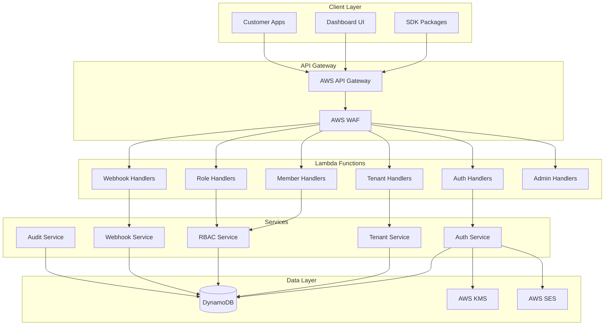

# Design Document: Zalt Enterprise Platform

## Overview

Zalt Enterprise Platform, Clerk'in çok üstünde enterprise-grade bir Auth-as-a-Service platformudur. 50+ projenin tam self-service entegre olabileceği, her dilde SDK desteği sunan, HIPAA/GDPR uyumlu bir authentication ve authorization çözümüdür.

### Key Design Principles

1. **Self-Service First**: Müşteriler manuel onay olmadan dakikalar içinde entegre olabilmeli
2. **Multi-Tenant Native**: Her müşteri izole realm alır, müşterilerin son kullanıcıları tenant'lar oluşturur
3. **Security by Default**: RS256 JWT, Argon2id hashing, WebAuthn, rate limiting varsayılan
4. **Developer Experience**: Kapsamlı SDK'lar, interaktif dokümantasyon, örnek uygulamalar
5. **Enterprise Ready**: SAML/OIDC SSO, audit logging, compliance raporları

### Architecture Overview

```
┌─────────────────────────────────────────────────────────────────┐
│                        Zalt Platform                             │
├─────────────────────────────────────────────────────────────────┤
│  Dashboard (app.zalt.io)    │    API (api.zalt.io)              │
│  - Customer onboarding      │    - /api/v1/auth/*               │
│  - Realm management         │    - /api/v1/tenants/*            │
│  - User management          │    - /api/v1/members/*            │
│  - Webhook configuration    │    - /api/v1/roles/*              │
│  - Analytics                │    - /api/v1/webhooks/*           │
├─────────────────────────────────────────────────────────────────┤
│                        Core Services                             │
│  ┌──────────┐ ┌──────────┐ ┌──────────┐ ┌──────────┐           │
│  │   Auth   │ │  Tenant  │ │   RBAC   │ │ Webhook  │           │
│  │ Service  │ │ Service  │ │ Service  │ │ Service  │           │
│  └──────────┘ └──────────┘ └──────────┘ └──────────┘           │
├─────────────────────────────────────────────────────────────────┤
│                        Data Layer                                │
│  ┌──────────┐ ┌──────────┐ ┌──────────┐ ┌──────────┐           │
│  │DynamoDB  │ │   KMS    │ │   SES    │ │CloudWatch│           │
│  │ Tables   │ │  Keys    │ │  Email   │ │  Logs    │           │
│  └──────────┘ └──────────┘ └──────────┘ └──────────┘           │
└─────────────────────────────────────────────────────────────────┘
```

## Architecture

### System Components



### Multi-Tenant Data Model

```
Realm (Customer Level)
├── realmId: "clinisyn" | "tediyat" | "finans"
├── name: "Clinisyn Healthcare"
├── settings: { mfa_policy, session_timeout, allowed_domains }
├── api_keys: { publishable_key, secret_key_hash }
└── branding: { logo, colors, email_from }

Tenant (End-User Organization Level)
├── tenantId: "ten_abc123"
├── realmId: "clinisyn"
├── name: "ABC Şirketi"
├── slug: "abc-sirketi"
├── metadata: { taxNumber, address }
└── settings: { user_limit, mfa_required }

User (End-User Level)
├── userId: "usr_xyz789"
├── realmId: "clinisyn"
├── email: "user@example.com"
├── profile: { firstName, lastName, phone }
└── mfa: { enabled, methods, backup_codes }

Membership (User-Tenant Relationship)
├── userId: "usr_xyz789"
├── tenantId: "ten_abc123"
├── roleIds: ["role_owner"]
├── directPermissions: ["reports:export"]
└── status: "active"
```

## Components and Interfaces

### 1. Authentication Service

```typescript
interface AuthService {
  // Registration
  register(data: RegisterInput): Promise<RegisterResult>;
  verifyEmail(token: string): Promise<void>;
  resendVerification(userId: string): Promise<void>;
  
  // Login
  login(credentials: LoginInput): Promise<LoginResult | MFARequired>;
  verifyMFA(sessionToken: string, code: string): Promise<LoginResult>;
  
  // Token Management
  refreshToken(refreshToken: string): Promise<TokenPair>;
  revokeToken(refreshToken: string): Promise<void>;
  
  // Password
  requestPasswordReset(email: string): Promise<void>;
  confirmPasswordReset(token: string, newPassword: string): Promise<void>;
  changePassword(userId: string, oldPassword: string, newPassword: string): Promise<void>;
  
  // Session
  listSessions(userId: string): Promise<Session[]>;
  revokeSession(sessionId: string): Promise<void>;
  revokeAllSessions(userId: string, exceptCurrent?: string): Promise<void>;
}

interface RegisterInput {
  email: string;
  password: string;
  firstName: string;
  lastName: string;
  phone?: string;
  companyName?: string;  // Creates tenant if provided
  metadata?: Record<string, unknown>;
}

interface LoginResult {
  user: User;
  tenants: TenantMembership[];
  tokens: TokenPair;
}

interface MFARequired {
  mfaSessionToken: string;
  methods: ('totp' | 'webauthn')[];
}

interface TokenPair {
  accessToken: string;
  refreshToken: string;
  expiresIn: number;
}
```

### 2. Tenant Service

```typescript
interface TenantService {
  // CRUD
  createTenant(realmId: string, userId: string, data: CreateTenantInput): Promise<Tenant>;
  getTenant(tenantId: string): Promise<Tenant>;
  updateTenant(tenantId: string, data: UpdateTenantInput): Promise<Tenant>;
  deleteTenant(tenantId: string): Promise<void>;
  
  // User Operations
  listUserTenants(userId: string): Promise<TenantMembership[]>;
  switchTenant(userId: string, tenantId: string): Promise<SwitchResult>;
  
  // Invitations
  inviteMember(tenantId: string, data: InviteInput): Promise<Invitation>;
  acceptInvitation(token: string, userData?: NewUserData): Promise<Membership>;
  revokeInvitation(invitationId: string): Promise<void>;
  listInvitations(tenantId: string): Promise<Invitation[]>;
}

interface CreateTenantInput {
  name: string;
  slug?: string;  // Auto-generated if not provided
  metadata?: Record<string, unknown>;
  settings?: TenantSettings;
}

interface SwitchResult {
  accessToken: string;
  tenant: Tenant;
  role: string;
  permissions: string[];
}

interface InviteInput {
  email: string;
  role: string;
  permissions?: string[];
  expiresIn?: number;  // Default: 7 days
}
```

### 3. RBAC Service

```typescript
interface RBACService {
  // Roles
  createRole(tenantId: string, data: CreateRoleInput): Promise<Role>;
  updateRole(roleId: string, data: UpdateRoleInput): Promise<Role>;
  deleteRole(roleId: string, fallbackRoleId: string): Promise<void>;
  listRoles(tenantId: string): Promise<Role[]>;
  getSystemRoles(): Role[];
  
  // Members
  listMembers(tenantId: string): Promise<Member[]>;
  updateMemberRole(tenantId: string, userId: string, roleId: string): Promise<Member>;
  addMemberPermissions(tenantId: string, userId: string, permissions: string[]): Promise<Member>;
  removeMember(tenantId: string, userId: string): Promise<void>;
  
  // Permission Checks
  checkPermission(userId: string, tenantId: string, permission: string): Promise<boolean>;
  getUserPermissions(userId: string, tenantId: string): Promise<string[]>;
}

interface CreateRoleInput {
  name: string;
  description?: string;
  permissions: string[];
  inheritsFrom?: string[];  // Role inheritance
}

// Default System Roles
const SYSTEM_ROLES = {
  owner: {
    id: 'role_owner',
    name: 'Owner',
    permissions: ['*:*'],  // All permissions
  },
  admin: {
    id: 'role_admin',
    name: 'Admin',
    permissions: ['*:read', '*:write', '*:delete', 'members:invite'],
  },
  member: {
    id: 'role_member',
    name: 'Member',
    permissions: ['*:read', '*:write'],
  },
  viewer: {
    id: 'role_viewer',
    name: 'Viewer',
    permissions: ['*:read'],
  },
};
```

### 4. Webhook Service

```typescript
interface WebhookService {
  // Configuration
  createWebhook(realmId: string, data: CreateWebhookInput): Promise<Webhook>;
  updateWebhook(webhookId: string, data: UpdateWebhookInput): Promise<Webhook>;
  deleteWebhook(webhookId: string): Promise<void>;
  listWebhooks(realmId: string): Promise<Webhook[]>;
  
  // Testing
  testWebhook(webhookId: string): Promise<WebhookTestResult>;
  
  // Delivery
  deliverEvent(event: WebhookEvent): Promise<void>;
  getDeliveryLogs(webhookId: string, limit?: number): Promise<DeliveryLog[]>;
}

interface CreateWebhookInput {
  url: string;
  events: WebhookEventType[];
  secret?: string;  // Auto-generated if not provided
}

type WebhookEventType = 
  | 'user.created' | 'user.updated' | 'user.deleted'
  | 'session.created' | 'session.revoked'
  | 'tenant.created' | 'tenant.updated'
  | 'member.invited' | 'member.joined' | 'member.removed'
  | 'role.changed'
  | 'mfa.enabled' | 'mfa.disabled';

interface WebhookEvent {
  id: string;
  type: WebhookEventType;
  timestamp: string;
  data: Record<string, unknown>;
}

// Webhook Payload Format
interface WebhookPayload {
  id: string;           // Event ID for idempotency
  type: string;         // Event type
  timestamp: string;    // ISO 8601
  data: {
    // Event-specific data
  };
}

// Signature: HMAC-SHA256(payload, secret)
// Header: X-Zalt-Signature: sha256=<signature>
```

### 5. MFA Service

```typescript
interface MFAService {
  // TOTP
  setupTOTP(userId: string): Promise<TOTPSetup>;
  verifyTOTP(userId: string, code: string): Promise<boolean>;
  disableTOTP(userId: string, password: string): Promise<void>;
  
  // Backup Codes
  generateBackupCodes(userId: string): Promise<string[]>;
  verifyBackupCode(userId: string, code: string): Promise<boolean>;
  
  // WebAuthn
  getWebAuthnRegistrationOptions(userId: string): Promise<RegistrationOptions>;
  verifyWebAuthnRegistration(userId: string, response: RegistrationResponse): Promise<void>;
  getWebAuthnLoginOptions(userId: string): Promise<LoginOptions>;
  verifyWebAuthnLogin(userId: string, response: LoginResponse): Promise<boolean>;
}

interface TOTPSetup {
  secret: string;
  qrCode: string;  // Data URL
  backupCodes: string[];
}
```

## Data Models

### DynamoDB Table Design

```typescript
// Single Table Design with GSIs

// Primary Key: PK (Partition Key), SK (Sort Key)
// GSI1: GSI1PK, GSI1SK
// GSI2: GSI2PK, GSI2SK

interface TableItem {
  PK: string;
  SK: string;
  GSI1PK?: string;
  GSI1SK?: string;
  GSI2PK?: string;
  GSI2SK?: string;
  type: string;
  data: Record<string, unknown>;
  created_at: string;
  updated_at: string;
  ttl?: number;
}

// Access Patterns:

// Users
// PK: REALM#<realmId>  SK: USER#<userId>
// GSI1PK: EMAIL#<email>  GSI1SK: REALM#<realmId>

// Tenants
// PK: REALM#<realmId>  SK: TENANT#<tenantId>
// GSI1PK: SLUG#<slug>  GSI1SK: REALM#<realmId>

// Memberships
// PK: TENANT#<tenantId>  SK: MEMBER#<userId>
// GSI1PK: USER#<userId>  GSI1SK: TENANT#<tenantId>

// Sessions
// PK: USER#<userId>  SK: SESSION#<sessionId>
// GSI1PK: REFRESH#<tokenHash>  GSI1SK: USER#<userId>

// Invitations
// PK: TENANT#<tenantId>  SK: INVITE#<inviteId>
// GSI1PK: INVITE_TOKEN#<token>  GSI1SK: TENANT#<tenantId>

// Roles
// PK: TENANT#<tenantId>  SK: ROLE#<roleId>
// (System roles: PK: SYSTEM  SK: ROLE#<roleId>)

// Webhooks
// PK: REALM#<realmId>  SK: WEBHOOK#<webhookId>

// Audit Logs
// PK: REALM#<realmId>#<YYYY-MM>  SK: AUDIT#<timestamp>#<eventId>
```

### User Model

```typescript
interface User {
  id: string;           // usr_<nanoid>
  realm_id: string;
  email: string;
  email_verified: boolean;
  password_hash: string;
  
  profile: {
    first_name: string;
    last_name: string;
    phone?: string;
    avatar_url?: string;
  };
  
  mfa: {
    enabled: boolean;
    methods: ('totp' | 'webauthn')[];
    totp_secret?: string;
    backup_codes?: string[];
    webauthn_credentials?: WebAuthnCredential[];
  };
  
  status: 'active' | 'suspended' | 'deleted';
  last_login_at?: string;
  created_at: string;
  updated_at: string;
}
```

### Tenant Model

```typescript
interface Tenant {
  id: string;           // ten_<nanoid>
  realm_id: string;
  name: string;
  slug: string;
  logo_url?: string;
  
  metadata: Record<string, unknown>;
  
  settings: {
    user_limit: number;
    mfa_required: boolean;
    allowed_domains?: string[];
    default_role_id: string;
  };
  
  status: 'active' | 'suspended' | 'deleted';
  member_count: number;
  created_at: string;
  updated_at: string;
}
```

### Membership Model

```typescript
interface Membership {
  user_id: string;
  tenant_id: string;
  realm_id: string;
  
  role_ids: string[];
  direct_permissions: string[];
  
  status: 'active' | 'invited' | 'suspended';
  invited_by?: string;
  invited_at?: string;
  joined_at?: string;
  
  is_default: boolean;  // Default tenant for user
  created_at: string;
  updated_at: string;
}
```

### Role Model

```typescript
interface Role {
  id: string;           // role_<nanoid> or role_owner, role_admin, etc.
  realm_id: string;     // '*' for system roles
  tenant_id?: string;   // null for realm-level roles
  
  name: string;
  description?: string;
  permissions: string[];
  inherits_from?: string[];
  
  is_system: boolean;
  created_at: string;
  updated_at: string;
}
```

### JWT Token Structure

```typescript
// Access Token Claims
interface AccessTokenClaims {
  sub: string;          // User ID
  email: string;
  tenant_id?: string;   // Current tenant (if switched)
  role?: string;        // Role in current tenant
  permissions?: string[]; // Permissions in current tenant
  realm_id: string;
  iat: number;
  exp: number;
  iss: string;          // https://api.zalt.io
  aud: string;          // Realm ID
}

// Refresh Token Claims
interface RefreshTokenClaims {
  sub: string;          // User ID
  jti: string;          // Token ID for rotation
  realm_id: string;
  iat: number;
  exp: number;
}
```

## Correctness Properties

*A property is a characteristic or behavior that should hold true across all valid executions of a system—essentially, a formal statement about what the system should do. Properties serve as the bridge between human-readable specifications and machine-verifiable correctness guarantees.*

### Property 1: Registration Creates Complete Account

*For any* valid registration input with email, password, and company name, the system SHALL create a user account, a tenant with the user as owner, and return valid tokens.

**Validates: Requirements 1.2, 2.2, 2.3**

### Property 2: Password Validation Rejects Weak Passwords

*For any* password that does not meet strength requirements (min 8 chars, uppercase, lowercase, number, special char), the system SHALL reject registration with a validation error.

**Validates: Requirements 2.1**

### Property 3: Login Returns Tokens and Tenant List

*For any* valid email/password combination, the system SHALL return an access token, refresh token, and list of tenants the user belongs to with their roles.

**Validates: Requirements 2.4**

### Property 4: MFA Flow Requires Verification Before Tokens

*For any* user with MFA enabled, login SHALL return an MFA session token instead of access tokens, and only after valid MFA code verification SHALL tokens be issued.

**Validates: Requirements 2.5, 2.6**

### Property 5: Token Refresh Rotates Refresh Token

*For any* valid refresh token, the system SHALL return a new token pair AND invalidate the old refresh token, preventing reuse.

**Validates: Requirements 2.7, 11.5**

### Property 6: Password Change Revokes Other Sessions

*For any* successful password change, the system SHALL revoke all sessions except the current one.

**Validates: Requirements 7.4, 9.4**

### Property 7: Tenant Creation Generates Unique Slug

*For any* tenant name, the system SHALL generate a URL-safe slug that is unique within the realm.

**Validates: Requirements 3.1**

### Property 8: Tenant Switch Issues Scoped Token

*For any* tenant switch request, the system SHALL issue a new access token with the tenant_id, role, and permissions claims set to the target tenant's values.

**Validates: Requirements 3.3**

### Property 9: Permission Check Evaluates Complete Permission Set

*For any* permission check, the system SHALL evaluate: (role permissions ∪ direct permissions) and return true if the required permission matches any granted permission including wildcards.

**Validates: Requirements 6.7**

### Property 10: Wildcard Permissions Match Correctly

*For any* permission check where user has `resource:*`, the system SHALL grant access to `resource:read`, `resource:write`, `resource:delete`, and any other action on that resource.

**Validates: Requirements 6.6**

### Property 11: JWT Contains Required Claims

*For any* issued access token, the token SHALL contain: sub, email, realm_id, iat, exp, iss, aud, and when tenant-scoped: tenant_id, role, permissions.

**Validates: Requirements 11.2**

### Property 12: Webhook Delivery Includes Valid HMAC Signature

*For any* webhook delivery, the X-Zalt-Signature header SHALL contain a valid HMAC-SHA256 signature of the payload using the webhook's secret key.

**Validates: Requirements 10.3**

### Property 13: Session Revocation Invalidates Immediately

*For any* session revocation request, subsequent API calls with that session's tokens SHALL return 401 Unauthorized.

**Validates: Requirements 9.2**

### Property 14: Invitation Expiry Rejects Acceptance

*For any* invitation that has passed its expiry time, acceptance attempts SHALL fail with an "invitation expired" error.

**Validates: Requirements 4.5**

## Error Handling

### Error Response Format

```typescript
interface ErrorResponse {
  error: string;        // Human-readable message
  code: string;         // Machine-readable code
  details?: Record<string, unknown>;
}

// Error Codes
const ERROR_CODES = {
  // Authentication
  INVALID_CREDENTIALS: 'Invalid email or password',
  EMAIL_NOT_VERIFIED: 'Please verify your email',
  MFA_REQUIRED: 'MFA verification required',
  INVALID_MFA_CODE: 'Invalid MFA code',
  SESSION_EXPIRED: 'Session has expired',
  TOKEN_EXPIRED: 'Token has expired',
  TOKEN_INVALID: 'Invalid token',
  
  // Authorization
  FORBIDDEN: 'Permission denied',
  INSUFFICIENT_PERMISSIONS: 'Insufficient permissions',
  
  // Validation
  VALIDATION_ERROR: 'Validation failed',
  INVALID_EMAIL: 'Invalid email format',
  WEAK_PASSWORD: 'Password does not meet requirements',
  
  // Resources
  NOT_FOUND: 'Resource not found',
  ALREADY_EXISTS: 'Resource already exists',
  
  // Rate Limiting
  RATE_LIMITED: 'Too many requests',
  ACCOUNT_LOCKED: 'Account temporarily locked',
  
  // Tenant
  TENANT_NOT_FOUND: 'Tenant not found',
  NOT_A_MEMBER: 'Not a member of this tenant',
  CANNOT_REMOVE_OWNER: 'Cannot remove owner',
  
  // Invitation
  INVITATION_EXPIRED: 'Invitation has expired',
  INVITATION_ALREADY_ACCEPTED: 'Invitation already accepted',
};
```

### Security Error Handling

```typescript
// Never reveal whether email exists
// Same response for valid/invalid emails on password reset
const handlePasswordReset = async (email: string) => {
  // Always return success, even if email doesn't exist
  return { message: 'If the email exists, a reset link has been sent' };
};

// Same timing for valid/invalid users (prevent timing attacks)
const handleLogin = async (email: string, password: string) => {
  const user = await findUser(email);
  
  // Always verify password hash, even for non-existent users
  const dummyHash = '$argon2id$...'; // Pre-computed dummy hash
  const hashToVerify = user?.password_hash || dummyHash;
  
  const valid = await verifyPassword(password, hashToVerify);
  
  if (!user || !valid) {
    throw new AuthError('INVALID_CREDENTIALS');
  }
  
  return user;
};
```

## Testing Strategy

### Dual Testing Approach

This platform requires both unit tests and property-based tests for comprehensive coverage:

1. **Unit Tests**: Verify specific examples, edge cases, and error conditions
2. **Property Tests**: Verify universal properties across all valid inputs

### Property-Based Testing Configuration

- **Library**: fast-check (TypeScript)
- **Minimum Iterations**: 100 per property
- **Tag Format**: `Feature: zalt-enterprise-platform, Property N: <property_text>`

### Test Categories

```typescript
// 1. Authentication Tests
describe('Authentication', () => {
  // Unit tests for specific scenarios
  it('should reject login with wrong password');
  it('should lock account after 10 failed attempts');
  
  // Property tests for universal behaviors
  it.prop('valid registration creates account', [validRegistrationArb], async (input) => {
    const result = await authService.register(input);
    expect(result.user.email).toBe(input.email);
    expect(result.tokens.accessToken).toBeDefined();
  });
});

// 2. RBAC Tests
describe('RBAC', () => {
  // Property tests for permission evaluation
  it.prop('wildcard permissions grant all actions', [permissionArb], async (perm) => {
    const user = await createUserWithPermission(`${perm.resource}:*`);
    const canRead = await rbacService.checkPermission(user.id, tenant.id, `${perm.resource}:read`);
    const canWrite = await rbacService.checkPermission(user.id, tenant.id, `${perm.resource}:write`);
    expect(canRead).toBe(true);
    expect(canWrite).toBe(true);
  });
});

// 3. Token Tests
describe('JWT Tokens', () => {
  // Property tests for token structure
  it.prop('access token contains required claims', [userArb, tenantArb], async (user, tenant) => {
    const token = await authService.generateAccessToken(user, tenant);
    const decoded = jwt.decode(token);
    expect(decoded.sub).toBe(user.id);
    expect(decoded.email).toBe(user.email);
    expect(decoded.tenant_id).toBe(tenant.id);
    expect(decoded.permissions).toBeDefined();
  });
});

// 4. Webhook Tests
describe('Webhooks', () => {
  // Property tests for signature verification
  it.prop('webhook signature is valid HMAC', [webhookEventArb], async (event) => {
    const { payload, signature } = await webhookService.prepareDelivery(event);
    const expectedSig = crypto.createHmac('sha256', webhook.secret)
      .update(JSON.stringify(payload))
      .digest('hex');
    expect(signature).toBe(`sha256=${expectedSig}`);
  });
});
```

### Generators (Arbitraries)

```typescript
import * as fc from 'fast-check';

// Valid email generator
const emailArb = fc.emailAddress();

// Strong password generator
const strongPasswordArb = fc.string({ minLength: 8, maxLength: 64 })
  .filter(p => /[A-Z]/.test(p) && /[a-z]/.test(p) && /[0-9]/.test(p) && /[!@#$%^&*]/.test(p));

// Tenant name generator
const tenantNameArb = fc.string({ minLength: 2, maxLength: 100 })
  .filter(n => n.trim().length >= 2);

// Permission generator
const permissionArb = fc.record({
  resource: fc.constantFrom('invoices', 'accounts', 'reports', 'users', 'settings'),
  action: fc.constantFrom('read', 'write', 'delete', '*'),
}).map(({ resource, action }) => `${resource}:${action}`);

// Registration input generator
const validRegistrationArb = fc.record({
  email: emailArb,
  password: strongPasswordArb,
  firstName: fc.string({ minLength: 1, maxLength: 50 }),
  lastName: fc.string({ minLength: 1, maxLength: 50 }),
  companyName: fc.option(tenantNameArb),
});
```
